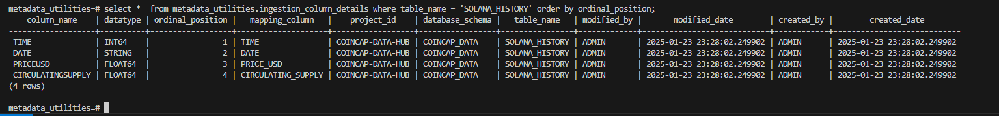
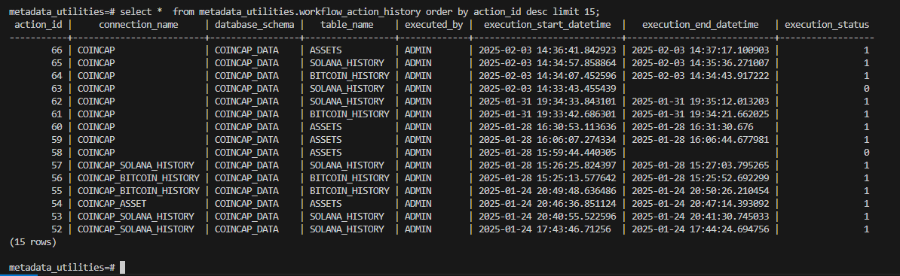
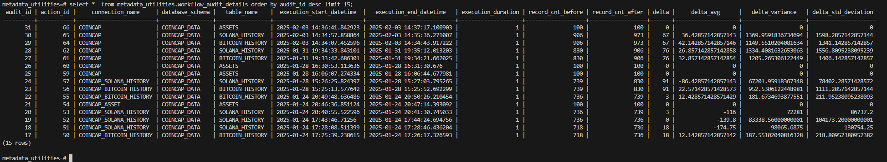

# Intro
The goal of this project repository is to build a data ingestion application to extract data from multiple sources and write that data into 
BigQuery as the target data warehouse. With this application the "extract" step of the ETL/ELT process is simplified allowing none technical
users to populate a simple SQL metadata template that will be used to populate a metadata database which in turn will be used to execute the 
data ingestion process. 

# Prerequisites

1. Docker Engine: <a href="https://docs.docker.com/engine/install/ubuntu/" target="_blank"> Docker Installation Documentation</a>

2. GCP Account (Free trial is offered)
    * Create a BigQuery Project for Metadata Utilities.
    * Create bucket for Metadata project
    * Create a Service Account for Metadata Project
    * Generate a keyfile Metadata Project

3. AWS Account (Free trial is offered) for AWS S3 bucket.

4. Request data sources (Free)
    * Coincap: To Generate API key refer to: <a href="https://docs.coincap.io/#intro" target="_blank">CoinCap - Documentation</a> 
    * Exchange Rate: To Generate API key refer to: <a href="https://www.exchangerate-api.com/" target="_blank"> Exchangerate-api - Documentation</a> 


# Docker Containers

1. **Create Network**

    * ```
      docker network create data-ingestion-network
      ```

2. **Postgres Container**

    * Build Postgres Image
        * ```
          docker build -t data-ingestion-postgres-app-image .
          ```

    * Run Postgres Container with Network
        * ```
          docker run -d --name data-ingestion-postgres-app-container --network data-ingestion-network data-ingestion-postgres-app-image
          ```
    * Run Postgres Container
        * ```
            docker run -d \
            --name data-ingestion-postgres-app-container \
            -e POSTGRES_USER=metadata_user \
            -e POSTGRES_PASSWORD=admin \
            -e POSTGRES_DB=metadata_utilities \
            -p 5432:5432 \
            -v /data:/var/lib/postgresql/data \
            data-ingestion-postgres-app-image
          ```

    * Open an interactive bash session inside the container
        * ```
            docker exec -it metadata-db bash
          ```

    * Inside the container, you can then use psql (PostgreSQL's command-line tool)
        * ```
            psql -U metadata_user metadata_utilities
          ```

3. **Python Container** 

    * Build Python Image
        * ```
            docker build -t data-ingestion-python-app-image .
          ```

    * Run Python Container with Network
        * ```
            docker run -d --name data-ingestion-python-app-container --network data-ingestion-network data-ingestion-python-app-image
          ```

    * Open Interactive bash session inside Python Container
        * ```
            docker exec -it data-ingestion-python-app-container bash
          ```

4. **Spark Container** 

    * Build Spark Image
        * ```
            docker build -t data-ingestion-spark-app-image .
          ```

    * Run Spark Container with Network
        * ```
            docker run -d --name data-ingestion-spark-app-container --network data-ingestion-network data-ingestion-spark-app-image
          ```

    * Open Interactive bash session inside Spark Container
        * ```
            docker exec -it data-ingestion-spark-app-container bash
          ```

# Postgres Metadata Utility Objects

The automation is utilizing a handful of Postgres tables in the `metadata-utilites` database. A user will enter data source connection information, table ingestion 
configurations, and column details into the metadata SQL tables. lastly, the user executes the python controller script with the required parser arguements which 
help identify the source we are accessing. 

The controller script will then pull the data ingestion details from the `metadata-utilities` tables and begin extraction from the data source. Ingesting 
the data into the target GCP storage. As the controller script runs, a log file is generated detailing each action taken, as well as the Start & End datetimess 
of the workflow execution which is recorded in the `workflow_action_history` table with a unique `action_id` for each job execution.


**ER Diagram:**


**INGESTION_CONNECTION_INFO**
This table will hold endpoint connection information as well as encrypted credentials


| Columns            | Description                                           |
|--------------------|-------------------------------------------------------|
| connection_id      | Unique ID for Connection                              |
| connection_name    | The name for the data source connection.              |
| connection_url     | The connection source URL, Host, Bucket Name etc.     |
| user_name          | The connection source user name (if Applicable).      |
| password_encrypted | The encrypted password for the connection source.     |
| security_token     | The Security Token or Access Key if applicable.       |
| created_by         | Individual who created the entry.                     |
| created_date       | Date the entry was created.                           |
| modified_by        | Individual who modified the entry.                    |
| modified_date      | Date the entry was modified.                          |


**INGESTION_CONFIG** 
The Ingestion Config table contains data/table ingestion configurations such as ingestion type, primary key, incremental or full data load, delimiter, file type etc.


**INGESTION_COLUMN_DETAILS**
The Ingestion Column Details table contains column details for the data that is being ingested such as column names, data types, ordinal positions, target table


| Columns            | Description                                                     |
|--------------------|-----------------------------------------------------------------|
| column_name        | The field / column names from the data source.                  |
| data_type          | The column name data type when writing data into target table.  |
| ordinal_position   | The ordinal position of the column when writing to target table.|
| mapping_column     | The column name for the target table.                           |
| project_id         | The Bigquery Project ID name. (Or Server Name).                 |
| database_schema    | The Target Database/Schema name.                                |
| table_name         | The Table name for the Data Source.                             |
| created_by         | Individual who created the entry.                               |
| created_date       | Date the entry was created.                                     |
| modified_by        | Individual who modified the entry.                              |
| modified_date      | Date the entry was modified.                                    |





**WORKFLOW_ACTION_HISTORY**
The Workflow Action History table contains an audit log of all workflow actions including connection_name, Start & End datetimestamps, the Workflow Execution Status and a 
unique `action_id` for each data ingestion workflow that is executed.


| Columns                       | Description                                                     |
|-------------------------------|-----------------------------------------------------------------|
| action_id                     | Unique ID For workflow execution                                |
| connection_name               | The name for the data source connection.                        |
| database_schema               | The Target Database/Schema name.                                |
| table_name                    | The Table name for the Data Source.                             |
| executed_by                   | Individual who executed the job run.                            |
| execution_start_datetime      | The Start Datetime when workflow started.                       |
| execution_end_datetime        | The completion datetime for workflow.                           |
| execution_status              | The workflow execution status.                                  |


| Execution_Status Values | Status |
|-------------------------|--------|
| In-Progress             | 0      |
| Complete                | 1      |
| Failed                  | -1     |





**WORKFLOW_AUDIT_DETAILS**
The Workflow Audit Details table contains statistical metadata for workflow actions such as record counts, deltas, variances and standard deviations.
Each workflow audit record has a unique `audit_id` amd map to the `workflow_action_history` table by `action_id`.


| Columns                       | Description                                                                                |
|-------------------------------|--------------------------------------------------------------------------------------------|
| action_id                     | Unique ID For workflow execution.                                                          |
| audit_id                      | Unique ID For workflow table audit.                                                        |
| connection_name               | The name for the data source connection.                                                   |
| database_schema               | The Target Database/Schema name.                                                           |
| table_name                    | The Table name for the Data Source.                                                        |
| execution_start_datetime      | The Start Datetime when workflow started.                                                  |
| execution_end_datetime        | The completion datetime for workflow.                                                      |
| execution_duration            | The duration of the workflow execution in minutes.                                         |
| record_cnt_before             | The record count for the target reference table prior to data load.                        |
| record_cnt_after              | The record count for the target reference table after data load.                           |
| delta                         | Record count delta  (record count after - record count before) for target reference table. |
| delta_avg                     | Delta Average for the last 7 job executions for target reference table.                    |
| delta_variance                | Delta Variance for the last 7 job executions for target reference table.                   |
| delta_std_deviation           | Delta Standard Deviation for the last 6 job executions for target reference table.         |





**SPARK_CONFIG**
The Spark Config table contains Spark Session Builder configurations that will be used to execute the Spark script as well as the 
GCP bucket details where the script is located


| Columns                       | Description                                                                                                                                                                                                                                        |
|-------------------------------|----------------------------------------------------------------------------------------------------------------------------------------------------------------------------------------------------------------------------------------------------|
| spark_id                      | Unique ID For workflow execution.                                                                                                                                                                                                                  |
| application_name              | The name for the spark application.                                                                                                                                                                                                                |
| executor_instances            | Determines the initial number of executors to allocate when the Spark application starts. By setting this value appropriately, you can control the initial parallelism of your Spark jobs.                                                         |
| executor_memory               | Sets the amount of memory to be used by each executor in the Spark cluster.                                                                                                                                                                        |
| executor_cores                | Specifies the number of cores to use on each executor.                                                                                                                                                                                             |
| driver_memory                 | Amount of memory to use for the driver process, i.e. where SparkContext is initialized, in the same format as JVM memory strings with a size unit suffix ("k", "m", "g" or "t") (e.g. 512m, 2g).                                                   |
| driver_cores                  | Number of cores to use for the driver process, only in cluster mode.                                                                                                                                                                               |
| auto_broadcast_join_threshold | Configures the maximum size in bytes for a table that will be broadcast to all worker nodes when performing a join. By setting this value to -1 broadcasting can be disabled. The default value is same with spark.sql.autoBroadcastJoinThreshold. |
| shuffle_partitions            | The default number of partitions to use when shuffling data for joins or aggregations. Note: For structured streaming, this configuration cannot be changed between query restarts from the same checkpoint location.                              |
| broadcast_timeout             | Timeout in seconds for the broadcast wait time in broadcast joins.                                                                                                                                                                                 |
| connection_id                 | Foreign key for Connection Id                                                                                                                                                                                                                      |
| connection_name               | The name for the data source connection.                                                                                                                                                                                                           |
| bucket                        | GCP Bucket name containing source spark script.                                                                                                                                                                                                    |
| source_file                   | Bucket path of source spark script.                                                                                                                                                                                                                |
| created_by                    | Individual who created the entry.                                                                                                                                                                                                                  |
| created_date                  | Date the entry was created.                                                                                                                                                                                                                        |
| modified_by                   | Individual who modified the entry.                                                                                                                                                                                                                 |
| modified_date                 | Date the entry was modified.                                                                                                                                                                                                                       |


# Log Format:

As the script runs a log will be recorded and uploaded to the `workflow_execution_details` bucket path. 
The log file will use the format `YYYYMMDD_<process_id>_<ingestion_type>_<connection_name>_<asset>.log`
Example: `20241215_100124_REQUEST_COINCAP_RATES_RATES.log`


# Data Ingestions: 

1. **REQUEST** 

* For a web request data source you will require the following components for a successful communication between the client and server.
    * Endpoint URL: Specific address where the API is hosted. 
    * Headers: Provides essential information for the server to process the request.
        * Content-Type: Specifies the format of the data being sent.
        * Authorization: Authentication information like API keys, tokens and/or other credentials
    * Parameters: These can be included in the URL query string or in the request body. Parameters are used to specify additional details about the request, such as filters, sorting criteria, or pagination.
    * Body: For POST, PUT, and PATCH requests, the body contains the data to be sent to the server. This could be in JSON, XML, or other formats
    * Authentication: Depending on the API, you may need to provide authentication details like API keys, OAuth tokens, or other credentials.
    * Versioning: Some APIs require specifying a version in the URL or headers to ensure compatibility with the correct API version.
    * Rate Limiting: Be aware of any rate limits imposed by the API provider to avoid hitting usage limits.


2. **AWS S3 BUCKET**

* AWS SDK for python to support S3 as a data source is available. The requirements to establish a S3 connection are the following.
    * AWS Access Key
    * AWS Security Token
    * Bucket Name
    * Prefix Path (Object Name)
    * File Name

* Boto3: <a href="https://boto3.amazonaws.com/v1/documentation/api/latest/index.html" target="_black">Boto3 - Documentation</a>


3. **GCS BUCKET**

* The Google Cloud Storage SDK for Python, also known as the Google Cloud Storage Python Client, is a library that allows you to interact with Google Cloud Storage from within your Python code.
    * key file ()
    * Storage Bucket Name
    * Prefix Path
    * File Name

* Google Cloud Storage: <a href="https://cloud.google.com/python/docs/reference/storage/latest" target="_black">Python Client for Google Cloud Storage</a>


4. **SFTP**

* TBD ...


5. Supported File Formats: 

* CSV
* TSV
* DAT
* JSON (TBD)
* Parquet (TBD)
* XLS (TBD)
* XLSX (TBD)


# Python Container: Parser details
* **Description: The data will be first loaded to a Flat File**
    * **-s:** The section name of configuration file, which will be used to direct workflow execution.
    * **-cn:** The connection name of the data source, which will be used to get the data source connection details.
    * **-a:** The asset name which will be used to get the object information.
    * **-lt:** Overrides the data load type. If not specified, the program will use the value in `ingestion_config` SQL table
        * FULL
        * INCR
    * **-c:** The configuration file to be used. If not specified, the program will try to find it with "./config.ini"
    * **-l:** Logging level, "info" by default.
        * info
        * debug
        * warning
        * error
    * **--print_log:** Whether print the log to console. False by default


## Example Data Ingestion Executions:
**NOTE:** The First data load should be a `FULL` data load. If `ingestion_config` is configured for `Incremental` you can override.

* **REQUEST W/ LOAD TYPE OVERRIDE:** 
    * ```
        python3 controller.py -s REQUEST -cn COINCAP -a BITCOIN_HISTORY -lt FULL -l info
      ```


* **REQUEST W/ CONFIGURATION FILE OVERRIDE:** 
    * ```
        python3 controller.py -s REQUEST -cn COINCAP -a ASSETS -c ./new_config.ini -l info
      ```


* **REQUEST W/ PRINT LOG ON TERMINAL:** 
    * ``` 
        python3 controller.py -s REQUEST -cn COINCAP -a ASSETS -l info  --print_log
      ```


* **AWS S3 BUCKET:** 
    * ```
        python3 controller.py -s S3 -cn S3_COINCAP -a SOLANA_HISTORY -l info
      ```

* **GOOGLE CLOUD STORAGE:**
    * ```
        python3 controller.py -s GCS -cn GCS_COINCAP -a SOLANA_HISTORY -l info
      ```

# **Spark Container**
The Spark **controller.py** script takes two system arguments. The first argument is the `connection_name` from the `ingestion_connection_info` table and, the
`application_name` from the `spark_config` table. As the script runs it will connect to the Postgres Database so we can collect the encrypted GCP Keyfile credentials
which will be used to access the target GCP project and the contents of the spark script that will be executing. It also collects the Spark Session builder configurations
which the controller will set internally which it than passes to the spark script contents we collected from the GCP bucket. With this setup we only need to update the
spark configurations within postgres database.


* **Example**
    * ```
      spark-submit controller.py gcs_coincap testexecution
      ```